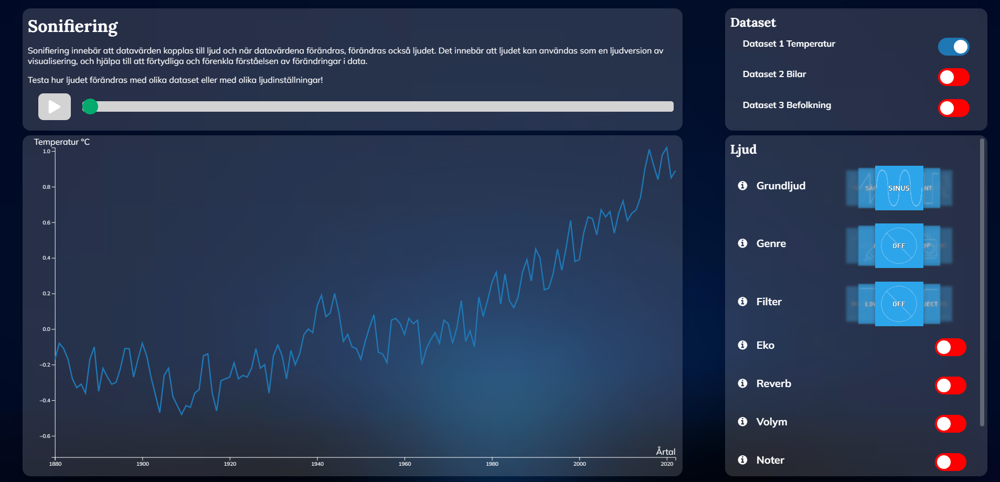

# TNM100-sonifiering

Project in course TNM100 - Strukturerade metoder för användarupplevelse (UX) at Linköping University VT2023.

This project conducts a sonification station of a traditional line graph. The user can click on the graph, sonifying the selected sample. A higher value on the graph will result in a higher pitch in the sonification, and a lower value will play a lower pitch sound. The sound can be customised through the panel on the right, changing the wave form, adding filters (lowpass, highpass, etc.), echo, reverb, volume and notes. When any of the discrete options are selected, the sonification will not rely on the pitch anymore, but depending on the option instead. When echo or reverb is selected, the played sound will echo more for higher values, and less for lower values. Same goes for when volume is selected. Lower values will sound less, and higher values will sound more. Notes on the other hand, will map the original frequencies from the pitch to discrete notes.

Three different datasets are suported. All datasets are time series, with quantitative values for the y axis. The current datasets display the average global temperature difference per year, the number of registered cars in Sweden per year, and the population of Sweden per year. Any other dataset with the same format would also work.



## Folder structure

```
.
├───app.js          # Server side JavaScript
├───css             # Styling, different files for different components
├───data            # Datasets, .csv format. Must be time series
├───images          # Images for the different carousel menus
├───js              # Client side JavaScript files
├───node_modules    # Necessary node modules
└───OSC             # Sample code for OSC web socket, not used in the project
```

## Setup instructions

- Make sure [Node.js](https://nodejs.org/en) is installed on the machine
- Make sure SuperCollider is installed on the machine
- Open the project folder in VSCode
- Open terminal in VSCode, make sure you are in the project folder and run:

```PowerShell
node app.js
```

- The server should now be accessible at [http://127.0.0.1:3000/](http://127.0.0.1:3000/)
- You might get an error that the Node server cannot find Supercollider. To solve this you have to move the desired file to the path the server requests.

## Known issues

The project members did not manage to use OSC through a web socket to connect to SuperCollider. Instead, supercollider.js was used which is not stable if too many outputs are created at once. Due to this, if users are too aggressive, the sounds introduce random noise/echos.
